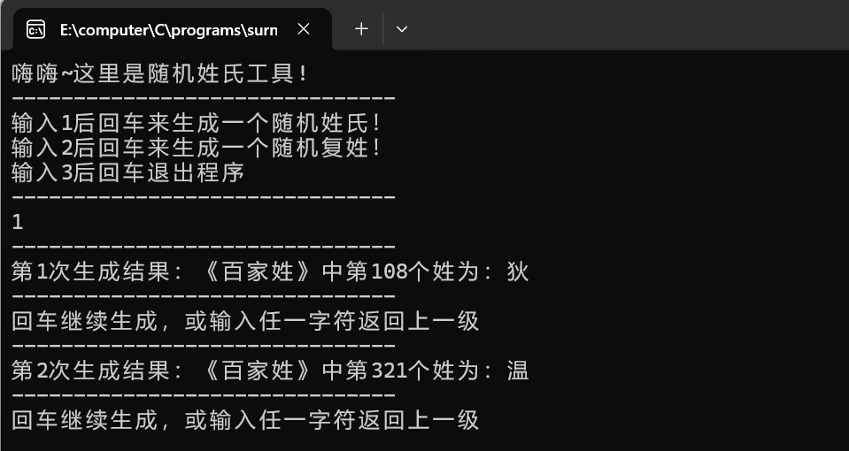

# surname
以《百家姓》中504个姓氏为数据库，随机生成一个姓氏，或者可以指定生成复姓。/ Using the 504 surnames from "Hundred Family Names" as a database, randomly generate a surname, or specify a compound surname.

### 使用说明
#### 一、程序下载 
打开想要保存在的文件目录，右键选择**在终端中打开**,输入以下内容回车
```
    git clone https://github.com/Wtemile/surname.git
```

#### 二、程序编译
完成后输入以下内容
```
    cd surname
    gcc ./src/surname.c -o surname.exe
```

#### 三、程序使用
双击文件夹中surname文件，弹出终端后按提示使用即可  
